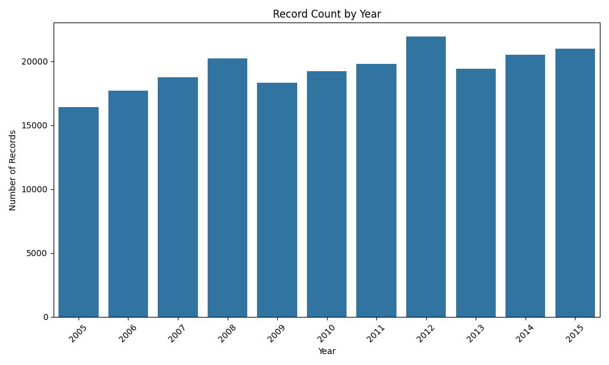
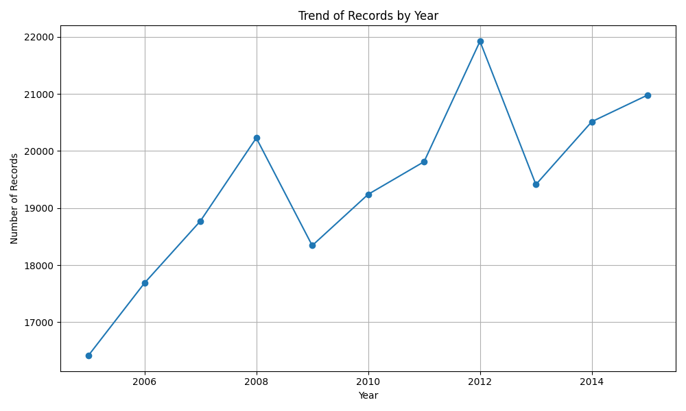

# Time-Related Data Consistency Check

## 📌 Objective
Evaluate the reliability of year-related fields in an 
Insurance Agency Performance dataset by performing 
systematic data quality checks.

## 📂 Dataset
- **File:** finalapi.csv
- **Domain:** Insurance Agency Performance
- **Total Records:** 2,13,328 rows
- **Total Columns:** 49 columns
- **Year-Related Columns:** 10 columns
- **Analysis Period:** 2005 – 2015

## 🛠️ Tools & Libraries
| Tool | Purpose |
|------|---------|
| Python | Programming language |
| Pandas | Data manipulation |
| NumPy | Numerical operations |
| Matplotlib | Visualizations |
| Seaborn | Statistical charts |

## 📋 Tasks Performed

### Task 1 — Identify Year Columns
- Programmatically detected all 10 year-related columns
- Filtered columns containing 'YEAR' in their name

### Task 2 — Missing Values & Range Analysis
- Built summary table with missing %, min and max year
- Found 6 out of 10 columns have 70–90% missing values

### Task 3 — Logical Consistency Checks
- End year < Start year check
- Future years > 2015 check
- Unrealistically old years < 1900 check
- Same start and end year check
- Agency appointment year > Profile year check
- Policy start year > Profile year check

### Task 4 — Field Selection
- Selected **STAT_PROFILE_DATE_YEAR** as most reliable
- 0% missing, no placeholders, realistic range 2005–2015

### Task 5 — Visualizations
- Bar chart: Record count by year
- Line chart: Trend of records over years

## 🧹 Data Cleaning Steps
1. Replaced **99999 placeholder values** with NaN
2. Filled NaN with **column mean** to preserve all rows

## 📊 Key Findings
- 10 year-related columns found out of 49 total
- 99999 used as placeholder — over 2,09,000 fake values in some columns
- 6 out of 10 year columns have 70–90% missing — unreliable
- Only **1 column** is fully clean and reliable
- Logical inconsistencies checked across all 4 start-end pairs
- After cleaning, dataset is ready for time-series analysis

## 📈 Visualizations

## ✅ Conclusion
The time-related fields in this dataset suffer from 
significant quality issues. However, STAT_PROFILE_DATE_YEAR 
stands out as the only fully reliable field suitable for 
time-series analysis.

## 💡 Recommendations
- Stop using 99999 as placeholder — use NULL instead
- Enforce validation: end year must always be ≥ start year
- Drop columns with >80% missing for modeling purposes
- Use STAT_PROFILE_DATE_YEAR as primary time dimension
  
## 👩‍💻 Author
**Nousheen Tabassum**  
B.E in Computer Science and Engineering  
CBIT — Cybersecurity, IoT and Blockchain Technology
